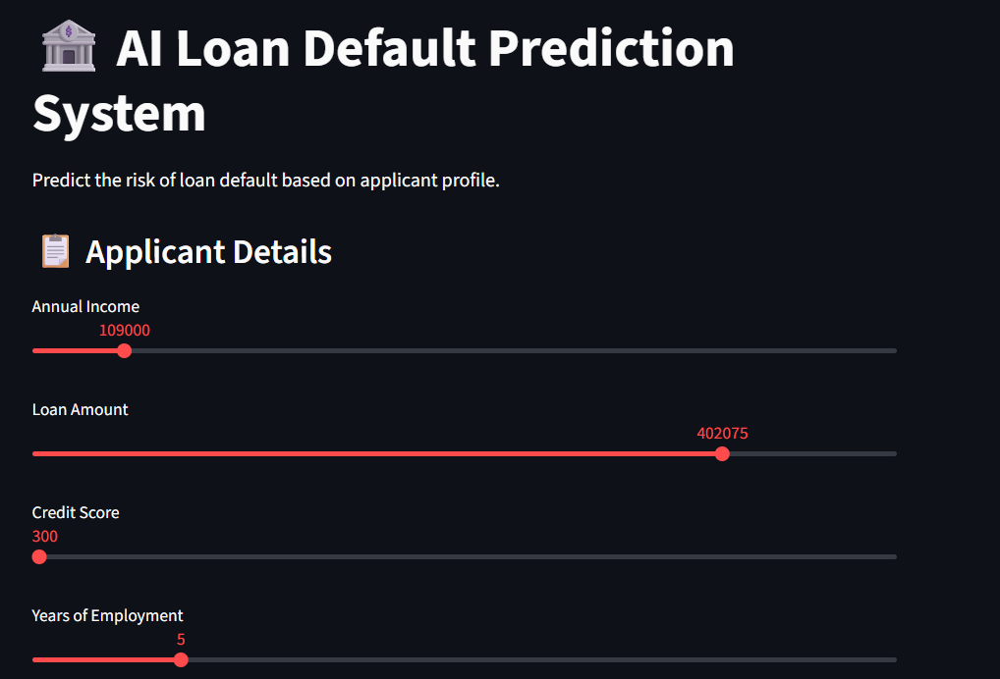
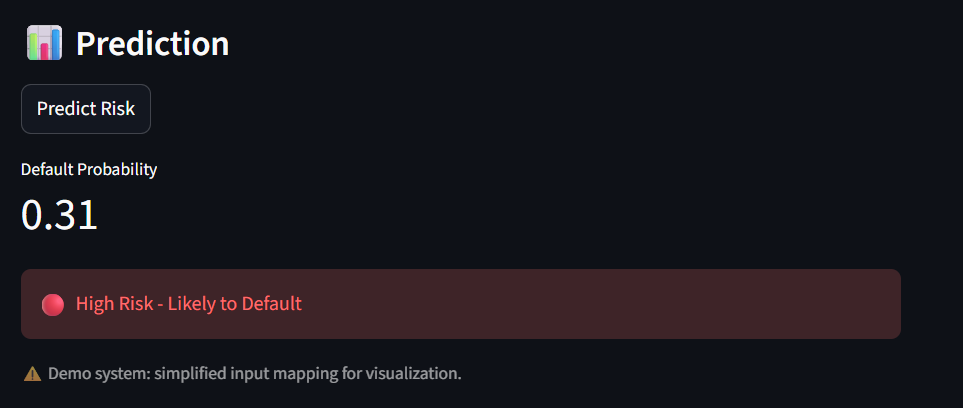

# 🏦 AI Loan Default Prediction System

An end-to-end Deep Learning system that predicts the likelihood of loan default based on applicant profile.

---

## 🚀 Overview

This project demonstrates a full machine learning pipeline:

- Data preprocessing & feature engineering
- Deep Learning model using TensorFlow/Keras
- Model training with early stopping
- Risk prediction system
- Interactive Streamlit application

---

## 🧠 Problem Statement

Financial institutions need to assess the risk of loan applicants defaulting.

This system predicts:

> Will a customer default on a loan?

---

## ⚙️ Tech Stack

- Python
- TensorFlow / Keras
- Scikit-learn
- NumPy / Pandas
- Streamlit

---

## 📊 Model Details

- Architecture: Artificial Neural Network (ANN)
- Input features: 120 engineered features
- Output: Probability of default
- Activation: Sigmoid
- Loss: Binary Crossentropy

---

## 📈 Risk Segmentation Logic

| Probability | Risk Level |
|------------|-----------|
| > 0.30     | 🔴 High Risk |
| 0.15–0.30  | 🟡 Medium Risk |
| < 0.15     | 🟢 Low Risk |

---

## 🖥️ Application Features

- User-friendly UI using Streamlit
- Interactive sliders for applicant data
- Real-time prediction
- Risk categorization

---

## ⚠️ Important Note

This is a demonstration system.

- Input mapping is simplified for visualization
- Original model uses engineered feature space

---

## 📂 Project Structure

ai-loan-default-dl-system/
│
├── data/
├── models/
├── notebooks/
├── src/
│ ├── preprocessing.py
│ ├── model.py
│ ├── train.py
│ ├── predict.py
│
├── app.py
├── requirements.txt
├── README.md

---

## ▶️ How to Run

### 1. Install dependencies

pip install -r requirements.txt

### 2. Train model

python -m src.train

### 3. Run app

streamlit run app.py

### Demo

🎯 Key Learnings
Handling imbalanced classification problems
Deep learning for tabular data
Model evaluation and threshold tuning
Converting ML models into applications

👨‍💻 Author

Viswa (AI/ML Engineer in progress 🚀)